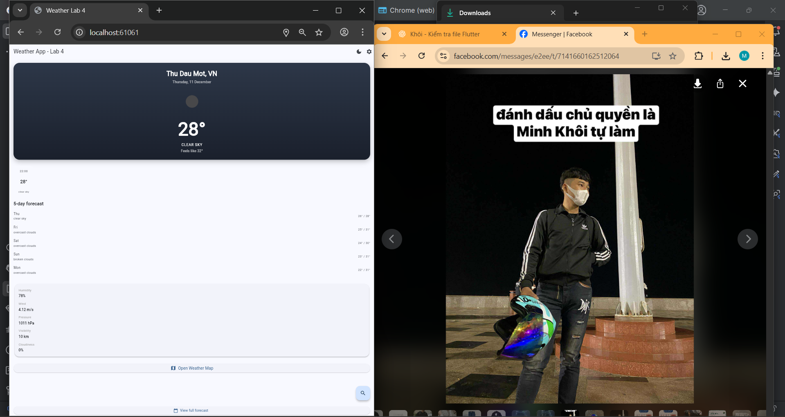
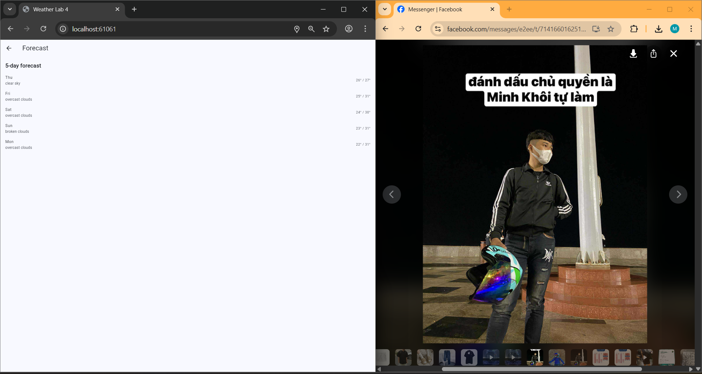
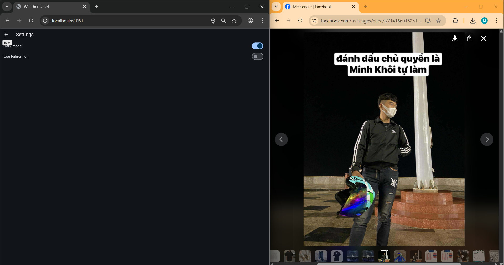
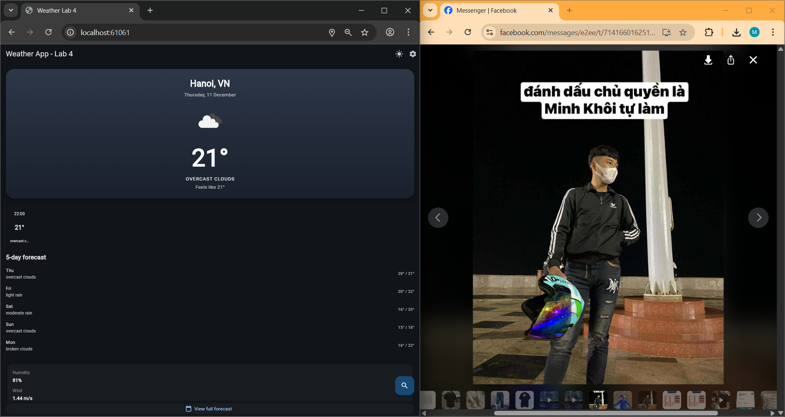
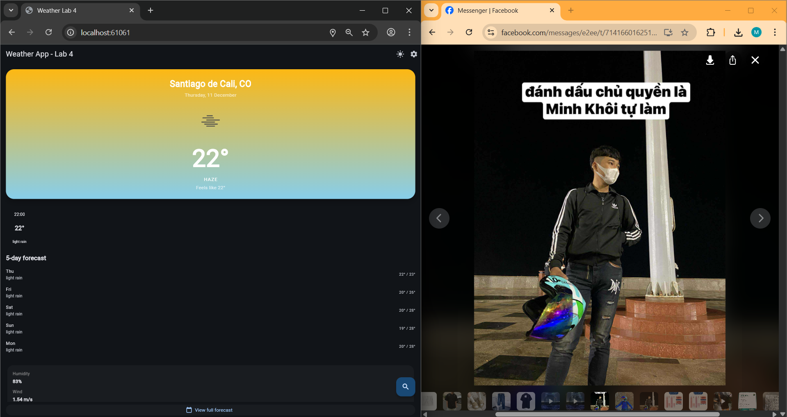
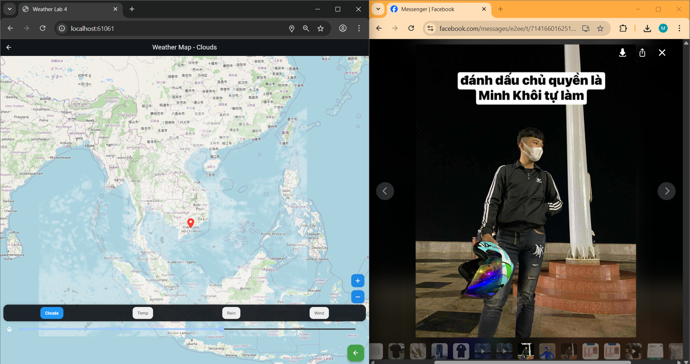
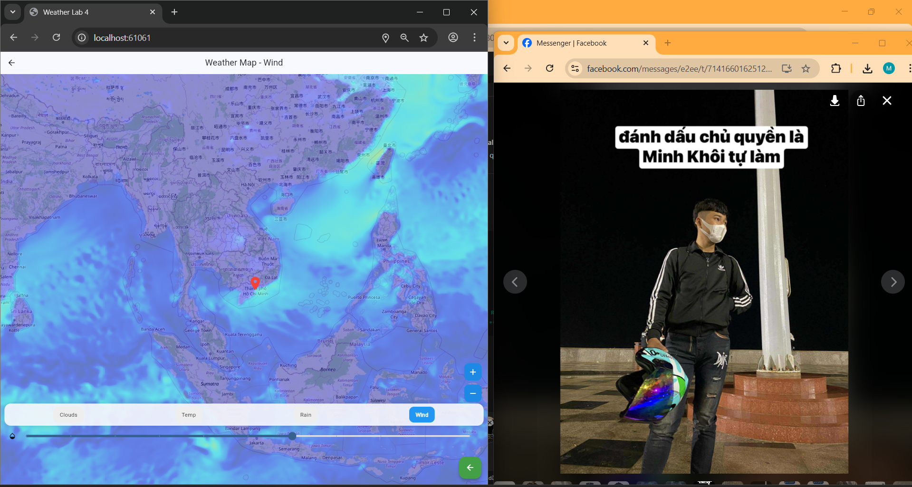

# 🌤️ Weather App – Lab 4 (Flutter)

Ứng dụng Weather App được xây dựng bằng Flutter cho bài Lab 4.  
Hỗ trợ xem thời tiết theo vị trí, xem dự báo, tìm kiếm thành phố, chuyển đổi theme, và xem Weather Map theo lớp mây – nhiệt độ – mưa – gió.

---

## 📸 Ảnh minh họa ứng dụng

> Các ảnh nằm trong thư mục `/screenshot` của project.

### 🏠 Home Screen


---

### 📅 Forecast Screen


---

### ⚙️ Settings (Dark Mode)


---

### 🔍 Search City – Example: Hanoi


---

### 🔍 Search City – Example: Santiago de Cali


---

## 🌍 Weather Map – Multi-layer OpenWeatherMap API

### ☁ Clouds Map


---

### 🌡 Temperature Map


---

### 🌧 Rain Map


---

### 💨 Wind Map


---

## ⭐ Tính năng chính

### 🌤 1. Xem thời tiết hiện tại
- Lấy vị trí GPS
- Hiển thị nhiệt độ, tình trạng thời tiết, cảm giác thực, icon dựa theo OpenWeatherMap

### 🕒 2. Dự báo theo giờ
- Dự báo trong 24 giờ
- Hiển thị icon + nhiệt độ theo từng giờ

### 📅 3. Dự báo 5 ngày
- Gom nhóm dữ liệu 3h/lần thành ngày
- Hiển thị min/max + mô tả

### ℹ️ 4. Thông tin chi tiết
- Độ ẩm
- Áp suất
- Tốc độ gió
- Mây che phủ
- Tầm nhìn

### 🔍 5. Tìm kiếm thành phố
- Nhập tên thành phố → xem thời tiết tức thì
- Lưu lịch sử tìm kiếm

### ⚡ 6. Offline Cache
- Lưu dữ liệu cuối cùng bằng shared_preferences
- Hoạt động khi mất mạng

### 🎨 7. Dark / Light Mode
- Chuyển đổi ngay trong UI
- Ghi nhớ trạng thái

### 🗺️ 8. Weather Map nâng cấp
- Lớp Clouds / Temperature / Rain / Wind
- Marker vị trí hiện tại
- Zoom in/out
- Slider opacity lớp overlay
- Giao diện đẹp, trực quan

---

## 🛠 Cách cài đặt

### 1️⃣ Clone project
```bash
git clone <repository-url>
cd weather_app
 
### 📁 Cấu trúc thư mục
lib/
 ├─ screens/
 │    ├─ home_screen.dart
 │    ├─ forecast_screen.dart
 │    ├─ search_screen.dart
 │    ├─ settings_screen.dart
 │    ├─ weather_map_menu.dart
 │    ├─ weather_map_screen.dart
 ├─ providers/
 ├─ services/
 ├─ widgets/
 ├─ utils/
 ├─ main.dart
---
###2️⃣ Tạo file .env
OPENWEATHER_API_KEY=YOUR_API_KEY
---
###3️⃣ Cài dependencies
flutter pub get
---
###4️⃣ Chạy ứng dụng
flutter run
---
